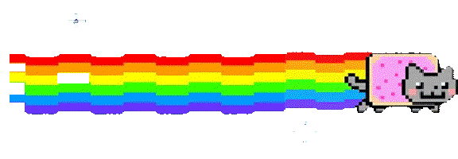

# Hey Everyone! I'm [Alex Viard](https://github.com/AlexViard) 
 

  

## 
<h4 align="center"><samp> Developer Fullstack JavaScript (React/Node) </samp></h4>

   

- 👷 <samp>See my portfolio [here](#).
- 🔭 <samp>I love the podcast of Harry JMG, Benjamin Code and Grafikart
- 💬 <samp>Ask me about JavaScript and React!
- 📫 <samp>How to reach me: mail, telephone and website.
-  ⚡ <samp>Fun fact: I am very afraid of spiders
- 🎮 <samp> I am a semi-pro call of duty player in a structure

 

##
<h3><b><samp>Skills and Languages</samp></b></h3>

  
  
  
  
  
  
  
  
  

    
##
<h3><b><samp>Tools and Platform</samp></b></h3>

  
  
  
  
  
  
  

  
### Github Stats
  

    <a href="https://github.com/AlexViard">
      
      
      
      
      
    
  </a>

 

 
  Visitor count 
  
  

  
